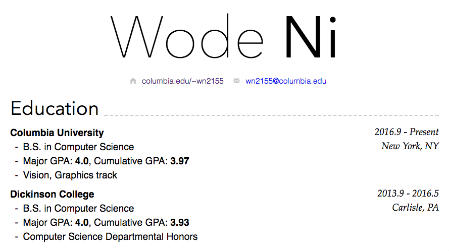

nimo-markdown-cv
================

<p align="center">

</p>

A curriculum vitae template that lets you write your CV in Markdown and export to HTML/PDF.

This project is a fork from [markdown-cv](http://elipapa.github.io/markdown-cv) with an alternative style theme.

## Stage 1 build system (Vite)

The local build workflow now runs on [Vite](https://vite.dev/) and no longer requires Jekyll for local development.

### Local development

1. Install Node.js 18+.
2. Install dependencies:

   ```bash
   pnpm install
   ```

3. Start dev server:

   ```bash
   pnpm dev
   ```

4. Open the printed-style CV preview (default): `http://localhost:5173`.

### Production build

```bash
pnpm build
pnpm preview
```

## Content source

- Edit your resume in `index.md`.
- Frontmatter is still supported.
- Current Markdown rendering includes compatibility for existing Liquid patterns used in this repo:
  - ``
  - `{{ page.homepage.url }}` and similar `{{ page.* }}` lookups

## PDF output

Use your browser print flow from the rendered page (`Cmd/Ctrl + P`).
Screen/print styles are served from `public/media/`.

## GitHub Pages deployment

GitHub Actions now builds and deploys the Vite output (`dist/`) to Pages on pushes to `master`.
Workflow file: `.github/workflows/pages.yml`.
