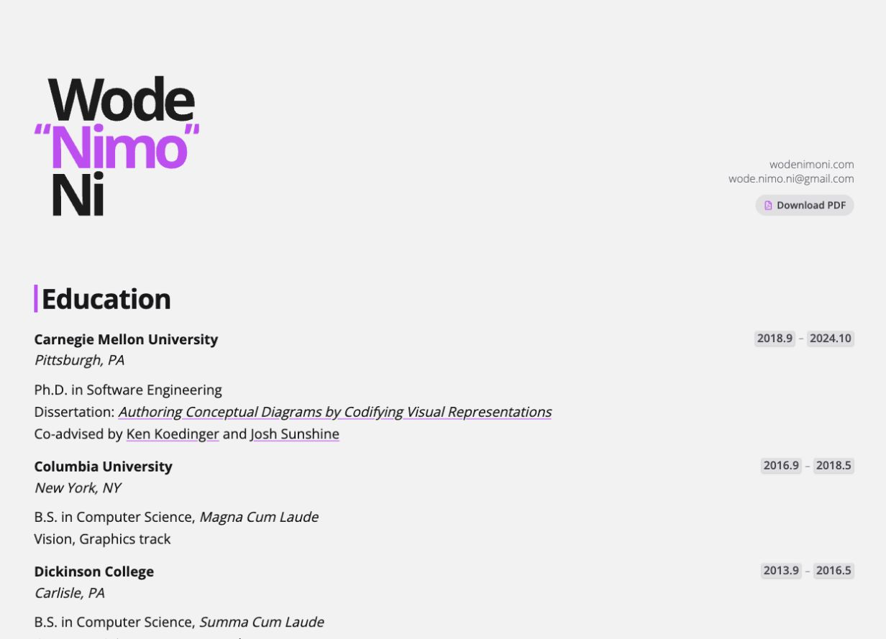

nimo-markdown-cv
================

<p align="center">

</p>

A curriculum vitae template that lets you write your CV in Markdown and export to HTML/PDF.

## Getting started

1. Install Node.js 18+.
2. Install dependencies:

   ```bash
   pnpm install
   ```

3. Start dev server:

   ```bash
   pnpm dev
   ```

4. Open the printed-style CV preview (default): `http://localhost:5173`.

## Development

This repo works with `pnpm`, `npm`, or `yarn`. CI uses `pnpm` and the committed `pnpm-lock.yaml`, so `pnpm` is the recommended default.

Common command equivalents:

```bash
# install
pnpm install
npm install
yarn install

# dev server
pnpm dev
npm run dev
yarn dev

# production build (includes dist/cv.pdf when Chrome is available)
pnpm build
npm run build
yarn build

# local preview
pnpm preview
npm run preview
yarn preview
```


## Content source

- Edit your resume in `index.md`.
- Contact items are rendered directly from frontmatter metadata.

Supported contact fields:

```yaml
title: Your Name
hero:
  image: media/your-wordmark.svg
homepage:
  url: https://example.com
  text: example.com
email:
  url: mailto:you@example.com
  text: you@example.com
phone: +1 (555) 555-5555
```

Use any subset of `homepage`, `email`, and `phone`; only provided fields are shown.

The `hero.image` field is optional. It accepts a path relative to the site root or
an absolute URL. When it is omitted—or when the image cannot load—the title is
rendered as a stacked text wordmark using the same black and purple styling.
Quoted nicknames such as `Alex "Lex" Smith` are automatically used as the purple
accent line.

## PDF output

Production builds generate `dist/cv.pdf` when Chrome or Chromium is available.
The **Download PDF** button downloads that file directly and falls back to the
browser print flow during development. Screen/print styles are served from
`public/media/`.
